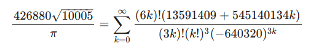
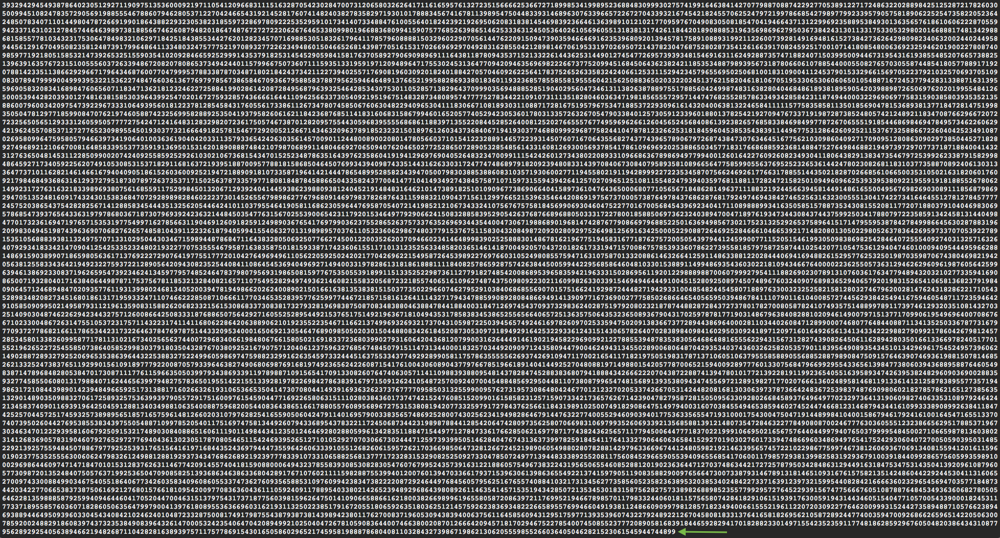

# Cálculo aproximado de Pi

A lo largo de la historia, varias personas han intentado hallar una fórmula que sirva para obtener una aproximación lo mas exacta posible del número Pi. Algunas fórmulas son muy precisas, pero todas tienen un margen de error cada cierto número elevado de decimales. Por suerte hoy disponemos de computadoras que permiten realizar cálculos a enormes velocidades.

A finales del año 2010 los matemáticos Alexander Yee y Shigeru Kondo utilizaron el Algoritmo de Chudnovsky como método para calcular los decimales de Pi y una computadora casera con 96 GB de memoria RAM para conseguir superar el record que ya poseían, y que actualmente es de 10 Billones de decimales. Para ello tardaron 371 días con la computadora trabajando a su máximo rendimiento. Toda una proeza, sin duda.

La expresión matemática del Algoritmo de Chudnovsky es la siguiente:



[Aquí](chudnovsky_simple.c) he hecho pequeño programa con el algoritmo en C que devuelve como resultado un valor escandalosamente aproximado de Pi con 16 dígitos. El resultado de su ejecución sería el siguiente:
  ```bash
  ./chudnovsky_simple
  3.1415926535897931
  ```
Pero esto no es suficiente. Si lo que queremos es obtener, por ejemplo, un millón de decimales o más tendremos que usar un método un poco diferente, y para ello utilizaremos la librería [GMP](https://gmplib.org/) de la [Free Software Foundation](https://www.fsf.org/). Esta librería nos proporcionará una serie de funciones y procedimientos aritméticos para nuestros cálculos, así que para poder probarlo es necesario instalar la librería en nuestro sistema antes de nada. [Aquí](chudnovsky.c) un ejemplo* de código C que tras ser compilado y ejecutado nos devolverá tantos dígitos de Pi como le hayamos indicado como argumento.

Por ejemplo, si queremos saber los 1000 primeros dígitos de Pi tendríamos que ejecutarlo de la siguiente manera:
  ```bash
  ./chudnovsky 1000
  ```

Y nos devuelve Pi con los siguientes 1000 dígitos:
  ```bash
  3.14159265358979323846264338327950288419716939937510582097494459230
  7816406286208998628034825342117067982148086513282306647093844609550
  5822317253594081284811174502841027019385211055596446229489549303819
  6442881097566593344612847564823378678316527120190914564856692346034
  8610454326648213393607260249141273724587006606315588174881520920962
  8292540917153643678925903600113305305488204665213841469519415116094
  3305727036575959195309218611738193261179310511854807446237996274956
  7351885752724891227938183011949129833673362440656643086021394946395
  2247371907021798609437027705392171762931767523846748184676694051320
  0056812714526356082778577134275778960917363717872146844090122495343
  0146549585371050792279689258923542019956112129021960864034418159813
  6297747713099605187072113499999983729780499510597317328160963185950
  2445945534690830264252230825334468503526193118817101000313783875288
  6587533208381420617177669147303598253490428755468731159562863882353
  78759375195778185778053217122680661300192787661119590921642019
  ```

Como curiosidad, si obtenemos 44904 decimales de Pi podremos observar que en la posición 44899 aparece la cadena... 44899. Alucinante, ¿verdad? Aquí se puede ver un fragmento de los últimos 44904 dígitos:



**IMPORTANTE**: No te recomiendo que pruebes a calcular un número de decimales de Pi muy elevado (por ejemplo un millón), ya que es posible que tu CPU comience a calentarse considerablemente. Este era un truco muy viejo que se usaba para "romper" el ordenador de alguien hace muchos años, y consistía en meter en el arranque un algoritmo que calculase decimales de Pi como si no hubiera mañana con "*unas pocas*" iteraciones.

**Agradecimientos a Brian "Beej Jorgensen" Hall.*

## Un Millón de dígitos de Pi
* [1millon_de_digitos_de_Pi.png](img/1millon_de_digitos_de_Pi.png) (21.7MB)
